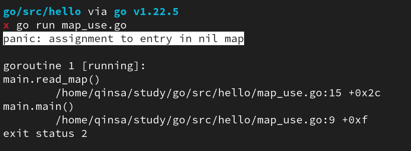
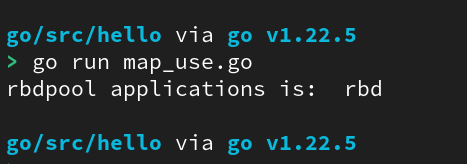
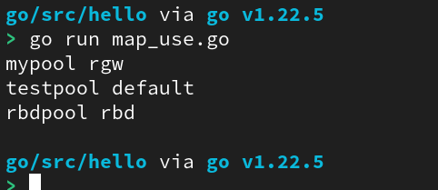
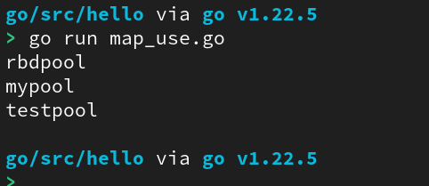
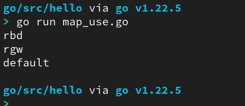

```
Go语言中的映射(map)是散列表的引用。
散列表是一种数据结构，是拥有键值对的无序集合。在这个集合中，键是唯一的；通过键可以获取与键对应的值。
类似 python 中的 dict
```


# 1. 定义 map

1. 使用字面量初始化 map

    ```go
    package main
    
    import (
        "fmt"
    )
    
    func main() {
        // 使用字面量初始化 map
        ages := map[string]int{
            "Alice":  25,
            "Bob":    30,
            "Charlie": 35,
        }
    
        // 访问和打印 map 中的元素
        fmt.Println("Alice's age:", ages["Alice"])    // 输出: Alice's age: 25
        fmt.Println("Bob's age:", ages["Bob"])        // 输出: Bob's age: 30
        fmt.Println("Charlie's age:", ages["Charlie"]) // 输出: Charlie's age: 35
    }
    
    ```


2. 使用 make 函数

    ```go
    package main
    
    import (
        "fmt"
    )
    
    func main() {
        // 使用 make 函数创建一个空的 map
        var ages map[string]int
        // 初始化为一个空的 map
        ages = make(map[string]int) 
    
        // 添加元素到 map
        ages["Alice"] = 25
        ages["Bob"] = 30
    
        // 访问和打印 map 中的元素
        fmt.Println("Alice's age:", ages["Alice"]) // 输出: Alice's age: 25
        fmt.Println("Bob's age:", ages["Bob"])     // 输出: Bob's age: 30
    }
    ```

    - ### `var ages map[string]int`

        这种方式仅仅声明了一个 `ages` 变量，但并没有初始化它。在 Go 语言中，声明一个 `map` 或者任何其它类型的变量，如果没有初始化，它的零值是 `nil`。

        也就是说此时是一个 `nil` map ，这意味着它并没有分配内存，不能直接用来存储键值对，如果尝试对一个 `nil` map 进行写操作，会导致运行时 `panic` 

        ```go
        package main
        
        import (
        	"fmt"
        )
        
        
        func main(){
        	read_map()
        }
        
        
        func read_map(){
        	var pools map[string]string
        	pools["rbdpool"] = "rbd"
        	fmt.Println("rbdpool applications is: ", pools["rbdpool"])
        }
        ```

        运行结果：




> map 的长度是动态的（相当于字典来使用），所以 map 里添加了 key：value 后，map 的长度会自动增加，因此声明 map 时不需要额外指定 map 的长度，尚未初始化的 map 默认值就是 nil


从定义 map 的方式可以看出：

- 所有键的 type 相同
- 所有值的 type 相同
- 键和值的 type 不一定相同


# 2. map 的基础使用

## 2.1 读取 map

```go
// 通过键读取
func read_map(){
	var pools map[string]string
	pools = make(map[string]string)
	pools["rbdpool"] = "rbd"
	fmt.Println("rbdpool applications is: ", pools["rbdpool"])
}
```




## 2.2 遍历 map

1. 获取所有键值对

```
for key，value ：= range mapname{}
```


eg.

```go
func read_map(){
	var pools map[string]string
	pools = make(map[string]string)
	pools["rbdpool"] = "rbd"
	pools["mypool"] = "rgw"
	pools["testpool"] = "default"

	for poolname, poolapplication := range pools{
		fmt.Println(poolname, poolapplication)
	}
}
```


 


2. 获取所有 key

    ```go
    for key := range mapname{}
    ```

    eg.

    ```go
    	for poolname := range pools{
    		fmt.Println(poolname)
    	}
    ```

    


​	


3. 获取所有 value

    ```go
    for _, value := range mapname{}
    ```

    eg.

    ```go
    	for _, poolapplication := range pools{
    		fmt.Println(poolapplication)
    	}
    ```

    


## 2.3 删除 map 元素

```go
delete(mapname, key)
```

- map 必须是已经声明并且初始化过的

