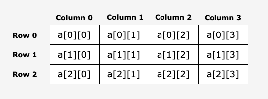

# 1. 数组 arry

数组是具有相同且唯一的数据类型的一组数据的数据项序列：

- 也就是说数组里的元素数据类型都相同，如 int 、string，或者是自定义类型
- 数组具有索引，从 0 开始
- 数据具有固定长度，声明后长度不可更改


## 1. 定义数组

1. 声明数组： 需要说明元素类型与个数

    ```go
    var arryName[size]dataType
    
    //
    var test[20]string
    ```


> 在声明时，arry 中的每个元素都会根据其类型默认自动初始化，如果元素类型是 int，那么默认值就是 0

```GO
func main() {
	var names[5]int
	fmt.Println(names)
}
```


2. 初始化数组： 

    使用初始化列表来初始化数组

    ```go
    var nums[5]int{1,2,3,4,5,}
    ```


3. 字面量定义数组

    ```go
    nums := [5]int{1,2,3,4,5}
    ```


4. 用 ... 代替 size： 如果不确定 arry 的长度，可以用 ... 代替，解释器会自己推算 arry 的长度

    ```go
    func main() {
    	test := [...]int{1,2,3,4,5,}
    	fmt.Println(len(test))
    }
    ```

    


>在 GO 中，数组大小是类型的一部分，因此不同大小的数组是不兼容的，也就是说 num[5]int 和 num[10]int 也是两个不同的类型


## 2. 访问数组元素

1. 通过索引访问元素
2. 通过 range 遍历元素

```go
func main() {
	test := [...]int{1,2,3,4,5,}
	fmt.Println(test[0])
	fmt.Println("get all data:")
	for i := range test{
		fmt.Println(i)
	}
}
```


3. 通过循环访问索引遍历元素

    ```go
    func main() {
    	test := [...]int{1,2,3,4,5,}
    	fmt.Println(test[0])
    	fmt.Println("get all data by index:")
    	for i := 0; i<5; i++{
    		fmt.Println(test[i])
    	}
    }
    ```

    


# 2. 多维数组

Go 支持多维数组，声明方式：

```go
var arryName[size1][size2][sizeN] dataType

var test[5][6]int
```


## 1. 二维数组

1. 声明 arry

    ```go
    var arryName[x][y]dataType
    ```

​	二维数组的本质就是一堆一维数组组成的




​	二维数组可以理解为一个嵌套数组，也就是数组的元素类型本身也是数组（切片）罢了


2. 初始化二维数组

    ```go
    test := [3][4]int{
        {0,1,2,3},
        {4,5,6,7},
    }
    ```

    >最后一个元素后面必须有逗号；
    >
    >或者将右花括号与最后一个元素并行写，最后一个元素后就可以不写逗号

    

    

3. 访问元素

    ```go
    func main() {
        // 二维切片
    	test := [][]int{}
        // a1 a2 都是切片
    	a1 := []int{1,2,3,4}
    	a2 := []int{5,6,7,8}
    	test = append(test, a1)
    	test = append(test, a2)
    	fmt.Println("get all test data by index:")
    	for i := 0; i<2; i++{
    		fmt.Println(test[i])
    	}
    	fmt.Println("get a1[3]")
    	fmt.Println(test[0][3])
    }
    ```

    

    


# 3. 切片 slice


前文提到，数组的长度是固定不可变的，那显然这在特定场合中是不适用的，因此 Go 还提供了一种更加灵活强悍的动态数组--切片

- 切片是对数组的抽象
- 长度不固定，可以追加元素
- 定义切片不需要说明长度


## 1. 定义切片

1. 声明未指定大小的切片

    ```go
    var sliceName[]type
    ```


2. 使用 make() 定义切片

    ```go
    var sliceName[]Tyep = make([]type, len)
    ```

    eg.

    ```go
    func main() {
    	var s1[]int = make([]int, 6)
    	fmt.Println(len(s1))
    }
    ```

    

还可以写为：

```go
s1 := make([]int, 6)
```


3. 定义容量

    ```go
    make([]T, length, capacity)
    ```

    - T 是切片的元素类型
    - len 是切片的长度，表示切片元素的个数
    - capacity 是切片的容量，表示切片底层数组中元素的个数，容量可以省略，省略时容量等于长度

    ```go
    func main() {
    	s1 := make([]int, 5, 10)
    	fmt.Println(len(s1))
    	fmt.Println(cap(s1))
    }
    ```

    

    - 这里说明 s1 是一个长度为 5，容量为 10 的整型切片；
    - 即使 s1 的长度为 5，但底层数组的实际容量为 10，也就是说可以在不重新分配内存的前提下，将最多 10 个元素添加进切片中


> 可以理解为长度表示当前切片中实际存储的元素个数，容量表示在不扩展内存的情况下，能存储的最大元素个数


## 2. 切片应用

### 2.1 append()：slice 的容量扩展

通过 `append` 函数向 slice 里追加元素

1. 当指定元素长度，append 的元素超过 len 时

```go
func main() {
	s1 := make([]int, 3)
	s1 = append(s1, 1)
	s1 = append(s1, 2)
	s1 = append(s1, 3)
	s1 = append(s1, 4)
	fmt.Println(len(s1))
	fmt.Println(cap(s1))
	for i := 0; i<len(s1); i++{
		fmt.Println(s1[i])
	}
}

```


- 说明切片的长度超过了初始定义的容量后，切片会自动扩展底层数组

- 容量的用途

    当切片的当前长度超过了容量时，go 就会自动扩展底层数组的容量。但因为这涉及到重新分配内存和复制元素，所以动态扩展容量其实是一个昂贵的操作，所以它会依照一定的动态扩展规则，尽可能的收束频繁申请内存带来的消耗

    换句话说，容量的作用就是在执行 append 这样的操作时，来判断是否需要更换新的底层数组，如果新的长度超过了原有底层数组的长度，就申请内存，更换底层数组，舍弃原有数组，并将原来的元素值拷贝到新的底层数组，如果没有操作就不更换，从而实现在数据拷贝和内存（申请或占用）消耗之间的一种平衡


- 为什么扩展后的容量是 12  -->  容量的扩展规则

    [部分源码](https://github.com/golang/go/blob/dfaaa91f0537f806a02ff2dd71b79844cd16cc4e/src/runtime/slice.go#L177)：

    - newcap： 最终的新容量
    - oldcap：原有容量
    - cap：新要扩容的容量

    ```go
    newcap := old.cap
    doublecap := newcap + newcap
    if cap > doublecap {
            newcap = cap
    } else {
            if old.cap < 1024 {
                    newcap = doublecap
            } else {
                    // Check 0 < newcap to detect overflow
                    // and prevent an infinite loop.
                    for 0 < newcap && newcap < cap {
                            newcap += newcap / 4
                    }
                    // Set newcap to the requested cap when
                    // the newcap calculation overflowed.
                    if newcap <= 0 {
                            newcap = cap
                    }
            }
    }
    ```

    >- 新申请扩容的容量大于旧容量的 2 倍，就用传入的新申请容量
    >
    >- 新申请扩容的容量小于等于旧容量的2倍
    >    - 旧容量小于 1024，就直接让新容量为旧容量的2倍
    >    - 旧容量大于等于 1024，新容量就扩展旧容量的四分之一

    

    - 如果需要扩容的容量大于原有容量的2倍，那新容量就会为这个旧容量的2倍，例如这里原有容量是 3，当 append 了第一个元素后，容量就需要扩展，此时扩展到 4，是不大于 6 的，因此会走 else 里的逻辑，此时 3 < 1024，所以新容量为 6
    - 继续 append，一直到 append 4 时，又需要扩容，依然是上面的逻辑，扩展到 12，已经能够装下 append 的 7 个元素和原有的 3 个元素，不需要继续扩展


### 2.2 copy() ：复制切片数据

函数签名：

```go
func copy(dst, src []T) int
```

- dst 是目标切片
- src 就是源切片
- T 是切片数据类型


1. 复制完整的切片数据

    ```go
    func main() {
    	s4 := []int{0,1,2,3,4,5,6}
    	s5 := make([]int, len(s4))
    	copy(s5, s4)
    	fmt.Println(s4)
    	fmt.Println(s5)
    }
    ```

    


2. 复制部分

    ```go
    func main() {
    	s4 := []int{0,1,2,3,4,5,6}
    	s5 := make([]int, 4)
    	copy(s5, s4[:4])
    	fmt.Println(s4)
    	fmt.Println(s5)
    }
    ```

    


## 3. nil （空）切片

一个切片在初始化之前，默认为 nil，长度为 0

```go
func main() {
	var s2 []int
	fmt.Println(len(s2))
	fmt.Println(s2)
}
```


## 4. 截取切片

和 `python` 一样，可以通过 `[start:end]` 来截取部分元素，并且都是左闭右开区间

```go
func main() {
	s3 := []int{0,1,2,3,4,5,6}
	fmt.Println(s3[:5])
	fmt.Println(s3[1:3])

}
```


