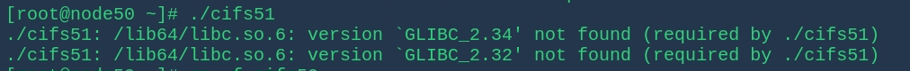

一般来说，开发环境里可以通过 `go run` 来调试执行文件，但是这个命令虽然方便，却不会生成可执行的二进制文件，为了方便程序的迁移，还需要用到构建命令

- `go build` ：编译包及其依赖，但不安装结果

    这里需要补充一点的是，有时候编译后发送文件给其他 linux 主机使用，可能有依赖相关的报错，例如

    

这可能就是因为本地系统上比较新的 `GLIBC` 库版本，而服务器上的 `GLIBC` 版本比较旧，缺少了 `GLIBC_2.32` 和 `GLIBC_2.34` 版本的支持。

此时可以尝试：

1. 方案1，静态链接

    - 尝试在编译时使用静态链接，这样可执行文件会包含所有依赖的库，不依赖于系统的动态链接库
    - 编译时加上 `-ldflags '-linkmode external -static'` 参数可以尝试静态链接，但是需要确保程序及其所有依赖都支持静态链接
    - 静态链接可能会增加执行文件的大小

    ```go
    go build -o mock_tcp -ldflags '-linkmode external -static' tcp.go
    ```


2. 禁用对应的 C 库依赖

    这里主要是针对图中的问题，通过静态编译使编译器禁用 CGO 支持

    ```bash
     export CGO_ENABLED=0
    ```

    也就是

    ```go
    CGO_ENABLED=0 go build xxx
    ```

    

`CGO_ENABLED` 是一个环境变量，用于控制 Go 编译器是否启用 CGO（C语言调用Go）支持。

- 当 `CGO_ENABLED=1` 时，Go 编译器会启用 CGO 支持，允许 Go 代码与 C 语言代码进行交互，包括使用 C 语言的库。
- 当 `CGO_ENABLED=0` 时，Go 编译器禁用 CGO 支持，所有的 Go 代码会被静态编译成独立的可执行文件，不依赖于外部的 C 库。


而 `go install` 可以在安装后不指定路径的情况下运行文件

可以参考：`https://go.p2hp.com/go.dev/doc/tutorial/compile-install`